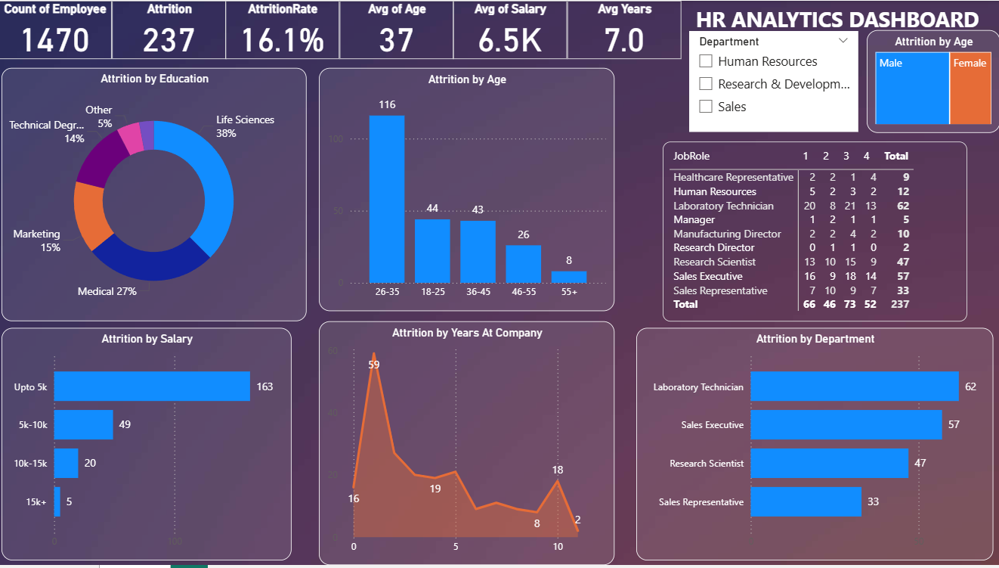

# Analysis
My First Dashboard Project: Employee Attrition Analysis

Project Overview :-This is my first dashboard project, where I analyzed employee attrition in a company to understand how and why employees leave.
The dashboard highlights attrition trends based on Education, Age, Salary, Tenure (Years at Company), and Department.

The goal of this project was to provide actionable insights to HR and management to improve employee retention.

Key Objectives :-

Identify the factors influencing attrition (education, salary, age, etc.).
Visualize attrition patterns with interactive dashboards.
Provide insights that can help reduce turnover and improve retention strategies.

Dashboard Features :-

Attrition by Education – Understand if qualification impacts attrition rates.
Attrition by Age – Identify which age groups are most likely to leave.
Attrition by Salary – Explore the relationship between compensation and attrition.
Attrition by Tenure – Analyze attrition trends by years spent in the company.
Attrition by Department – Detect high-turnover departments.

Tools & Technologies Used :-
Power BI – For building dashboard, data visualization, data cleaning and preprocessing.

Dashboard Preview

Key Insights :-
Young employees (26–35 age group) had the highest attrition.
Lower salary ranges showed higher attrition.
Early tenure employees (0–2 years) were more likely to leave.
Certain departments had significantly higher turnover.
Education level had a minor but noticeable effect.

Conclusion :-

This project helped me learn how to collect, clean, and analyze HR data and how to build my first interactive Power BI dashboard.
It gave me hands-on experience with HR Analytics and data visualization techniques.

🖥 GitHub: [your GitHub profile]
